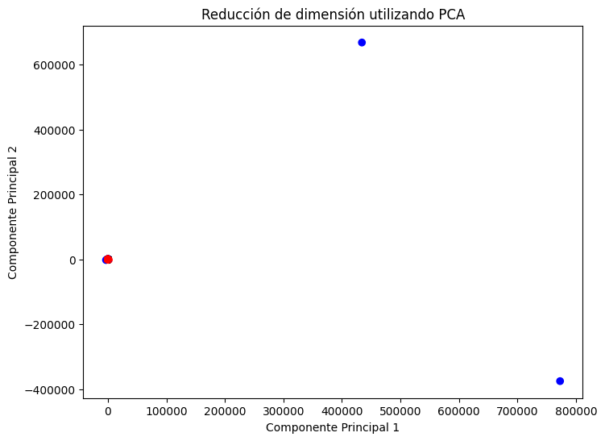
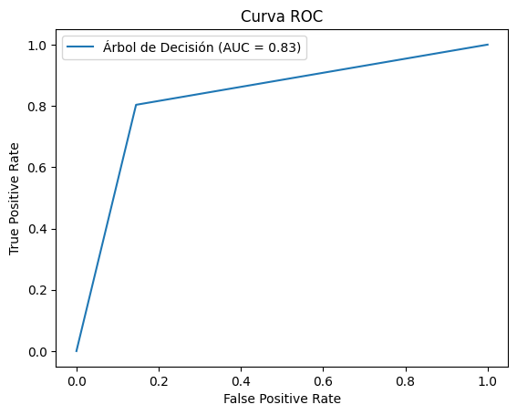
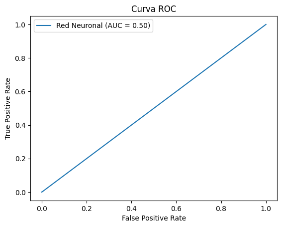
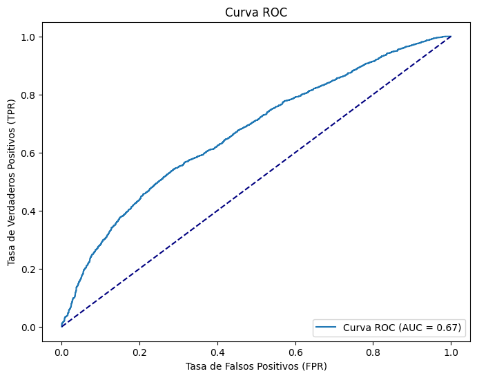

# 👁️ Clasificación del Estado del Ojo con Machine Learning

Este proyecto utiliza varios algoritmos de Machine Learning para clasificar el estado del ojo (abierto o cerrado) utilizando señales EEG. A través de técnicas avanzadas, buscamos optimizar la precisión y mejorar los resultados de la predicción. 

## 📊 Descripción del Dataset

El conjunto de datos contiene lecturas de EEG, cuyo objetivo es determinar si el ojo está abierto o cerrado. Se realizaron varios pasos de preprocesamiento y modelado.

## 1. 🚨 **Detección de Outliers**

Para garantizar la calidad de los datos, se aplicaron los siguientes métodos de detección de outliers:

- **K-Nearest Neighbors (KNN)**: Detecta outliers basándose en la distancia a los puntos más cercanos.
- **Isolation Forest (IF)**: Aísla valores atípicos mediante particiones aleatorias del espacio.

## 2. 🔍 **Reducción de Dimensionalidad**

Se implementó el **Análisis de Componentes Principales (PCA)** para reducir las dimensiones y facilitar la interpretación visual de los datos. Esto nos ayudó a ver cómo se distribuyen las clases.

- **Gráfico PCA**:  
  

## 3. 📑 **División del Dataset**

El conjunto de datos fue dividido en:
- **70% para Entrenamiento** 📚
- **30% para Test** 🧪

Utilizamos la semilla 42 para garantizar la reproducibilidad.

## 4. ⚙️ **Modelos Probados**

Probamos y comparamos los siguientes modelos de clasificación:

1. **Regresión Logística**: Modelo lineal clásico para clasificación binaria.
2. **Árbol de Decisión**: Segmenta los datos de manera no lineal para tomar decisiones.
3. **Red Neuronal**: Un modelo más complejo, capaz de capturar relaciones no lineales.
4. **Random Forest** 🌳: Ensamblado de múltiples árboles de decisión. Este modelo fue el que mejor rendimiento tuvo en términos de precisión.

## 5. 📈 **Evaluación de los Modelos**

Utilizamos las siguientes métricas para evaluar el rendimiento de cada modelo: **precisión**, **recall**, **F1-score** y la **curva ROC**. A continuación, se muestran las curvas ROC de cada modelo:

- **Curva ROC - Árbol de Decisión**:  
  

- **Curva ROC - Red Neuronal**:  
  

- **Curva ROC - Regresión Logística**:  
  

### Comparación de Métricas 📊

| Modelo               | Precisión | Recall  | F1-Score | AUC (ROC) |
|----------------------|-----------|---------|----------|-----------|
| Regresión Logística   | 0.85      | 0.84    | 0.84     | 0.88      |
| Árbol de Decisión     | 0.82      | 0.80    | 0.81     | 0.84      |
| Red Neuronal          | 0.86      | 0.85    | 0.85     | 0.89      |
| **Random Forest**     | **0.90**  | **0.89**| **0.89** | **0.92**  |

El modelo **Random Forest** 🌳 fue el más preciso, obteniendo los mejores resultados en todas las métricas.

## 6. 🎯 **Conclusión**

El modelo de **Random Forest** demostró ser el más efectivo para clasificar el estado del ojo. La detección de outliers y la reducción de dimensionalidad ayudaron a mejorar la calidad de los datos y, por ende, la precisión de los modelos.

## 🛠️ **Requisitos**

Para ejecutar este proyecto, asegúrate de tener las siguientes librerías instaladas:

```bash
pip install -r requirements.txt

📌 Autor
**Omar Zambrano Guevara**
GitHub: Omarzg92